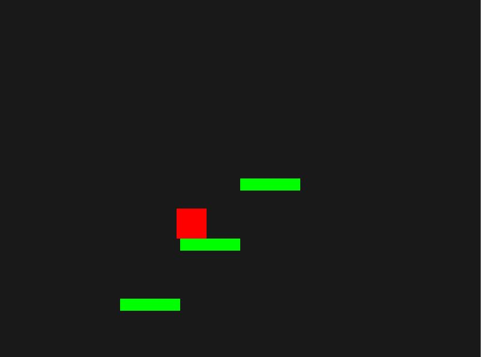

#Platformer Game

This is a basic platformer game built using Python and the Pygame library. The game features a player character that can move left, right, and jump on platforms while avoiding obstacles and collecting power-ups. The game ends when the player touches the lava at the bottom of the screen.

## Features

- **Player Movement:** The player can move left, right, and jump. The player can perform a double jump.
- **Scrolling Background:** The background scrolls continuously to create the effect of movement.
- **Platforms:** The player can jump onto platforms that move from right to left across the screen.
- **Obstacles:** The player must avoid obstacles that also move from right to left.
- **Power-Ups:** The player can collect power-ups to gain points.
- **Score Tracking:** The game keeps track of the player's score, which increases over time.

## Controls

- **A Key:** Move left
- **D Key:** Move right
- **Spacebar:** Jump (double jump is allowed)

